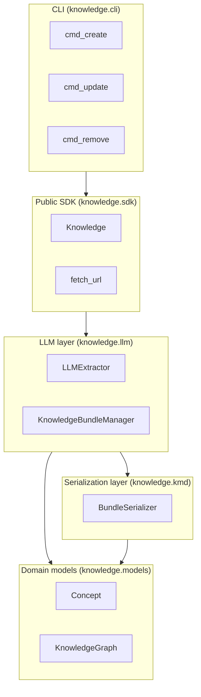
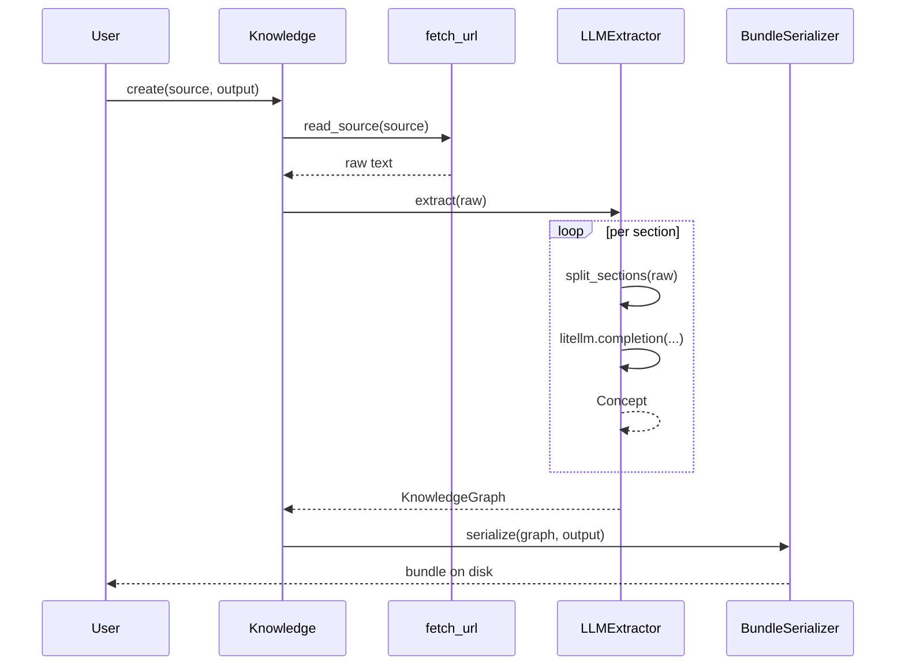
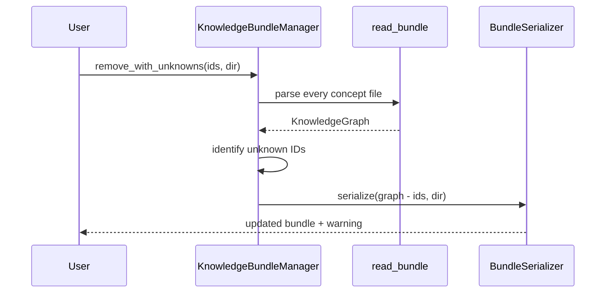

# Architecture

`knowledge` follows a layered design: the `Knowledge` class is a thin public facade that delegates work to a LLM-extraction layer and an OKF-serialization layer. Domain models sit underneath both.

## Layered overview

The CLI and the SDK are interchangeable entry points: the CLI parses arguments and calls the SDK, and the SDK exposes every operation as a plain Python method.

## Data flow

### Create

### Update

`update` follows the same flow as `create` but writes back to an existing directory. The directory is **completely replaced**: every concept file is regenerated and any stale `.md` file (in directories the serializer owns) is removed.

!!! warning

    Hand-edited concept files are lost on `update`. If you need to keep manual edits, run `update` and then `remove` the regenerated concepts you want to discard.

### Remove

`remove_with_unknowns` returns `(written_count, unknown_ids)` so callers can detect typos. The CLI surfaces unknown IDs as a warning and exits with status code `2`.

## Why section-based extraction?

Most documentation is structured by headings: `<h2>` for chapters, `<h3>` for sections, `<h4>` for sub-topics. Splitting on headings gives natural concept boundaries, keeps each prompt within common context windows, and avoids truncation of long documents.

The extractor falls back to the next strategy when the previous one finds nothing:

1. HTML `<h1>`–`<h6>` (with HTML comments stripped first).
2. Markdown `#`–`######` (ATX-style, with optional trailing `#` and Setext underlines).
3. Treat the entire document as a single section named `Document`.

## Why frozen Pydantic models?

`Concept` and `KnowledgeGraph` are `frozen=True`. Every mutation returns a **new** instance. The benefits:

- **Thread safety.** Graphs can be shared without defensive copies.
- **Predictable pipelines.** A stage never silently mutates its inputs.
- **Cheap snapshots.** Use the graph as a key in caches or as a test fixture without surprises.

The cost is occasional O(n) copies for `add_concept` and `remove_concept`. For the expected bundle sizes (< 1000 concepts) this is negligible; if your bundles grow significantly, batch construction at init time is faster than incremental updates.

## Why no PyYAML dependency?

Frontmatter is written and parsed using a simple line-based convention rather than a full YAML parser. This avoids adding PyYAML as a dependency for a very limited schema (key-value pairs and a comma-separated tag list). The `yaml_escape` / `yaml_unescape` pair handles control characters for round-trip fidelity.

## Error handling

All SDK exceptions inherit from `KnowledgeError`:

- `FetchError` — source cannot be fetched, read, or exceeds the size limit.

The CLI catches every exception at the `main()` boundary, logs the message, and returns a non-zero exit code:

| Exit code | Meaning |
|-----------|---------|
| `0` | Success. |
| `1` | Unrecoverable error (network, filesystem, validation). |
| `2` | Partial success — at least one requested concept ID was unknown. |

## Threading and concurrency

The frozen models are safe to share. The HTTP client, litellm calls, and filesystem I/O are not — call them from a single thread at a time, or use your own locking. For high-throughput extraction, consider running multiple `Knowledge` instances in parallel against different sources.
