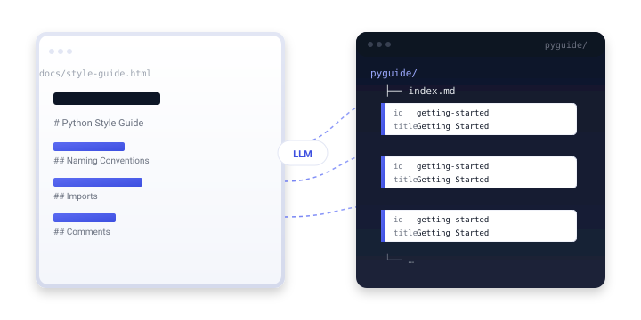

<!-- =====================================================================
     1. HERO
     ===================================================================== -->
<section class="kn-hero">
  

    

      

        <h1 class="kn-hero__title">
          Documentation, structured. 
          <em>Output: a knowledge bundle.</em>
        </h1>
        

          <code>knowledge</code> is a Python SDK and CLI that splits any URL or file by heading,
          sends each section to a large language model for structured concept extraction, and writes
          an <strong>OKF v0.1</strong> directory bundle of linked Markdown files &mdash; versionable,
          diffable, and ready to serve as a static site.
        

        

          <a class="kn-btn kn-btn--primary" href="getting-started/">
            <svg xmlns="http://www.w3.org/2000/svg" viewBox="0 0 24 24" width="18" height="18"><path fill="currentColor" d="M5 3a2 2 0 0 0-2 2v14a2 2 0 0 0 2 2h14a2 2 0 0 0 2-2V5a2 2 0 0 0-2-2H5Zm0 2h14v14H5V5Zm2 2v2h2V7H7Zm4 0v2h6V7h-6Zm-4 4v2h2v-2H7Zm4 0v2h6v-2h-6Zm-4 4v2h2v-2H7Zm4 0v2h6v-2h-6Z"/></svg>
            Install &amp; Get Started
          </a>
          <a class="kn-btn kn-btn--ghost" href="api/">
            <svg xmlns="http://www.w3.org/2000/svg" viewBox="0 0 24 24" width="18" height="18"><path fill="currentColor" d="M14 2H6a2 2 0 0 0-2 2v16a2 2 0 0 0 2 2h12a2 2 0 0 0 2-2V8l-6-6Zm0 2 4 4h-4V4ZM6 4h6v6h6v10H6V4Zm2 9v2h8v-2H8Zm0 4v2h5v-2H8Z"/></svg>
            Read the Docs
          </a>
          <a class="kn-btn kn-btn--ghost" href="https://github.com/sachncs/knowledge">
            <svg xmlns="http://www.w3.org/2000/svg" viewBox="0 0 24 24" width="18" height="18"><path fill="currentColor" d="M12 .5C5.65.5.5 5.65.5 12c0 5.08 3.29 9.39 7.86 10.91.58.1.79-.25.79-.55v-2.03c-3.2.7-3.88-1.37-3.88-1.37-.52-1.33-1.27-1.69-1.27-1.69-1.04-.71.08-.7.08-.7 1.15.08 1.76 1.18 1.76 1.18 1.02 1.75 2.69 1.24 3.34.95.1-.74.4-1.24.72-1.53-2.55-.29-5.24-1.28-5.24-5.69 0-1.26.45-2.28 1.18-3.09-.12-.29-.51-1.46.11-3.05 0 0 .97-.31 3.18 1.18a11.06 11.06 0 0 1 5.79 0c2.21-1.5 3.18-1.18 3.18-1.18.62 1.59.23 2.76.11 3.05.74.81 1.18 1.84 1.18 3.09 0 4.42-2.69 5.4-5.25 5.68.41.36.78 1.05.78 2.13v3.16c0 .31.21.66.8.55C20.21 21.39 23.5 17.07 23.5 12 23.5 5.65 18.35.5 12 .5Z"/></svg>
            Star on GitHub
          </a>
        

        

          <strong>pip install</strong><code>knowledge</code>
          <strong>Python</strong>3.12 +
          <strong>License</strong>MIT
          <strong>Status</strong>v0.1.0-alpha
        

      

      <figure class="kn-hero__visual" aria-label="A documentation page decomposed by section heading into an OKF bundle of linked Markdown files.">
        
      </figure>

    

  

</section>

<!-- =====================================================================
     2. PROBLEM / OUTCOME
     ===================================================================== -->
<section class="kn-section kn-section--alt">
  

    The problem
    <h2>Flat transcripts aren&rsquo;t infrastructure.</h2>
    

      Most LLM extraction tools hand you a Markdown blob. You can&rsquo;t diff sections, you can&rsquo;t link
      between them, and you certainly can&rsquo;t version them. <code>knowledge</code> produces a
      directory of files &mdash; one concept per heading &mdash; so the output behaves like real
      documentation, not a chat log.
    

    

      <article class="kn-compare__panel kn-compare__panel--bad">
        <header class="kn-compare__head">
          &#9888; Without knowledge
          one wall of text
        </header>
        <pre class="kn-compare__body"># Python Style Guide

The Python style guide covers naming conventions, imports, comments,
typing, and error handling. Naming should be descriptive and consistent.
Modules use snake_case, classes use PascalCase, constants use UPPER_CASE.
Imports should be on separate lines and grouped by standard library,
third-party, and local. Comments should explain the why, not the what.
Type annotations are encouraged on public APIs. Errors should be
specific and actionable. Linting with ruff is recommended. Formatting
with ruff format is recommended. Tests with pytest are recommended.
^ no structure, no links, no diffs</pre>
      </article>

      <article class="kn-compare__panel kn-compare__panel--good">
        <header class="kn-compare__head">
          &#10003; With knowledge
          a directory of concepts
        </header>
        <pre class="kn-compare__body">pyguide/
&#9500;&#9472;&#9472; index.md
&#9500;&#9472;&#9472; naming-conventions.md
&#9500;&#9472;&#9472; imports.md
&#9500;&#9472;&#9472; comments.md
&#9500;&#9472;&#9472; type-annotations.md
&#9492;&#9472;&#9472; error-handling.md

^ one concept per file,
  linked via [link](file.md)</pre>
      </article>

    

  

</section>

<!-- =====================================================================
     3. HOW IT WORKS
     ===================================================================== -->
<section class="kn-section">
  

    How it works
    <h2>Four steps from URL to bundle.</h2>
    

      The pipeline is intentionally narrow: read a source, split by heading, ask an LLM, write files.
      No retriever, no vector store, no agent loop.
    

    <ol class="kn-steps">
      <li class="kn-step">
        

        <h4>Read source</h4>
        
Fetch a URL with retries, size limits, and charset detection &mdash; or read a local Markdown or HTML file.

      </li>
      <li class="kn-step">
        

        <h4>Split by heading</h4>
        
Decompose the document into sections using HTML <code>&lt;h1&gt;</code>&ndash;<code>&lt;h6&gt;</code> or Markdown <code>#</code>&ndash;<code>######</code>.

      </li>
      <li class="kn-step">
        

        <h4>Extract concepts</h4>
        
Send each section to a litellm-routed model and parse a strict JSON shape: <code>id</code>, <code>name</code>, <code>description</code>, <code>tags</code>.

      </li>
      <li class="kn-step">
        

        <h4>Write OKF bundle</h4>
        
Serialize every concept as a Markdown file with YAML frontmatter, generate <code>index.md</code> at every level, and run structural validation.

      </li>
    </ol>
  

</section>

<!-- =====================================================================
     4. CORE FEATURES
     ===================================================================== -->
<section class="kn-section kn-section--alt">
  

    Core features
    <h2>Everything you need to ship a knowledge bundle.</h2>
    

      Built for the workflow you already have, not the workflow a vendor wants to sell you.
    

    

      <article class="kn-feature">
        
          <svg viewBox="0 0 24 24" fill="none" stroke="currentColor" stroke-width="1.8" stroke-linecap="round" stroke-linejoin="round"><path d="M4 17l6-6 4 4 6-6"/><path d="M14 9h6v6"/></svg>
        
        <h4>CLI and Python API</h4>
        
Use <code>knowledge create</code>, <code>update</code>, and <code>remove</code> from a shell, or import the SDK and call <code>Knowledge</code> from Python. Same surface, same guarantees.

      </article>

      <article class="kn-feature">
        
          <svg viewBox="0 0 24 24" fill="none" stroke="currentColor" stroke-width="1.8" stroke-linecap="round" stroke-linejoin="round"><circle cx="12" cy="12" r="9"/><path d="M3 12h18M12 3a14 14 0 0 1 0 18M12 3a14 14 0 0 0 0 18"/></svg>
        
        <h4>Any model, one interface</h4>
        
Routes OpenAI, Anthropic, Google Gemini, AWS Bedrock, Azure OpenAI, Ollama, vLLM, and NVIDIA NIM through litellm. Switch providers by changing one string.

      </article>

      <article class="kn-feature">
        
          <svg viewBox="0 0 24 24" fill="none" stroke="currentColor" stroke-width="1.8" stroke-linecap="round" stroke-linejoin="round"><path d="M3 12a9 9 0 0 1 15.5-6.3L21 8"/><path d="M21 3v5h-5"/><path d="M21 12a9 9 0 0 1-15.5 6.3L3 16"/><path d="M3 21v-5h5"/></svg>
        
        <h4>Resilient fetching</h4>
        
Exponential backoff, 50 MiB body cap, charset detection, HTTP error classification, and 4xx pass-through. Your bundles don&rsquo;t vanish because a CDN hiccuped.

      </article>

      <article class="kn-feature">
        
          <svg viewBox="0 0 24 24" fill="none" stroke="currentColor" stroke-width="1.8" stroke-linecap="round" stroke-linejoin="round"><path d="M9 12l2 2 4-4"/><circle cx="12" cy="12" r="9"/></svg>
        
        <h4>Bundle validation</h4>
        
Every <code>create --validate</code> run checks link resolution, orphan files, and frontmatter shape. Catch a broken link before it ships to a static site.

      </article>

      <article class="kn-feature">
        
          <svg viewBox="0 0 24 24" fill="none" stroke="currentColor" stroke-width="1.8" stroke-linecap="round" stroke-linejoin="round"><rect x="3" y="4" width="18" height="16" rx="2"/><path d="M7 8h10M7 12h10M7 16h6"/></svg>
        
        <h4>Markdown + YAML frontmatter</h4>
        
Every concept file is plain Markdown with <code>id</code>, <code>title</code>, <code>type</code>, and <code>tags</code> frontmatter. Diff it, grep it, edit it in any text editor.

      </article>

      <article class="kn-feature">
        
          <svg viewBox="0 0 24 24" fill="none" stroke="currentColor" stroke-width="1.8" stroke-linecap="round" stroke-linejoin="round"><path d="M12 3v18M3 12h18"/><circle cx="12" cy="12" r="9"/></svg>
        
        <h4>Tag-based grouping</h4>
        
A <code>path_map</code> routes concepts by tag into subdirectories. <code>{"guide": "docs/guides"}</code> sends every <em>guide</em> concept to <code>docs/guides/</code>. Nest as deep as you like.

      </article>

    

  

</section>

<!-- =====================================================================
     5. OUTPUT VISUALIZATION
     ===================================================================== -->
<section class="kn-section">
  

    Output
    <h2>A directory you can read, edit, and ship.</h2>
    

      The bundle is yours &mdash; plain Markdown, simple YAML, relative links. No proprietary
      containers, no opaque binary blobs.
    

    

      <pre class="kn-bundle__tree">pyguide/
&#9500;&#9472;&#9472; index.md            # root index, links every concept
&#9500;&#9472;&#9472; getting-started.md
&#9500;&#9472;&#9472; naming-conventions.md
&#9500;&#9472;&#9472; imports.md
&#9500;&#9472;&#9472; style-rules/
&#9474;&nbsp;&nbsp;&nbsp; &#9500;&#9472;&#9472; index.md    # subdirectory index
&#9474;&nbsp;&nbsp;&nbsp; &#9500;&#9472;&#9472; semicolons.md
&#9474;&nbsp;&nbsp;&nbsp; &#9500;&#9472;&#9472; line-length.md
&#9474;&nbsp;&nbsp;&nbsp; &#9492;&#9472;&#9472; whitespace.md
&#9492;&#9472;&#9472; reference/
&nbsp;&nbsp;&nbsp;&nbsp; &#9500;&#9472;&#9472; index.md
&nbsp;&nbsp;&nbsp;&nbsp; &#9500;&#9472;&#9472; glossary.md
&nbsp;&nbsp;&nbsp;&nbsp; &#9492;&#9472;&#9472; resources.md

OKF v0.1 # directory-based, versionable, diffable</pre>

      <article class="kn-bundle__sample">
        <header class="kn-bundle__sample-head">
          <svg xmlns="http://www.w3.org/2000/svg" viewBox="0 0 24 24" width="14" height="14"><path fill="currentColor" d="M14 2H6a2 2 0 0 0-2 2v16a2 2 0 0 0 2 2h12a2 2 0 0 0 2-2V8l-6-6Zm0 2 4 4h-4V4ZM6 4h6v6h6v10H6V4Zm2 9v2h8v-2H8Zm0 4v2h5v-2H8Z"/></svg>
          <code>naming-conventions.md</code>
        </header>
<pre class="kn-bundle__body">---
id: naming-conventions
title: "Naming Conventions"
type: concept
tags: ["guide", "naming"]
---

## Naming Conventions

Modules use `snake_case`, classes use `PascalCase`,
and constants use `UPPER_CASE`. Names should be
descriptive &mdash; avoid single-letter names outside of short
loop counters.

See also: [Imports](imports.md), [Style Rules](style-rules/index.md).
</pre>
      </article>

    

  

</section>

<!-- =====================================================================
     6. QUICKSTART
     ===================================================================== -->
<section class="kn-section kn-section--alt">
  

    Quickstart
    <h2>From <code>pip install</code> to a bundle in 60 seconds.</h2>
    

      Set one environment variable, run one command. The CLI handles retries, validation, and
      YAML escaping.
    

    

      

        <h3 style="font-size: 1rem; color: var(--kn-text-muted); text-transform: uppercase; letter-spacing: 0.08em; font-weight: 600; margin: 0 0 1rem;">Install</h3>
        

          

            <i></i><i></i><i></i>
            ~ / your shell
          

          <pre class="kn-terminal__body">$ pip install knowledge
Successfully installed knowledge-0.1.0

$ export OPENAI_API_KEY=sk-...

$ knowledge create https://google.github.io/styleguide/pyguide.html ./pyguide
Creating bundle from pyguide.html...
done (3.4s)
Wrote 66 concepts to ./pyguide
Validation: OK</pre>
        

      

      

        <h3 style="font-size: 1rem; color: var(--kn-text-muted); text-transform: uppercase; letter-spacing: 0.08em; font-weight: 600; margin: 0 0 1rem;">Python API</h3>
        

          

            <i></i><i></i><i></i>
            python &raquo; from knowledge import Knowledge
          

<pre class="kn-terminal__body">&gt;&gt;&gt; from knowledge import Knowledge

&gt;&gt;&gt; k = Knowledge(model="gpt-4o")

&gt;&gt;&gt; graph = k.create("https://google.github.io/styleguide/pyguide.html")
&gt;&gt;&gt; len(graph.concepts)
66

&gt;&gt;&gt; k.create_bundle("https://google.github.io/styleguide/pyguide.html", "./pyguide")
66
</pre>
        

      

    

  

</section>

<!-- =====================================================================
     7. WHY OKF
     ===================================================================== -->
<section class="kn-section">
  

    Why OKF
    <h2>A bundle, not a transcript.</h2>
    

      OKF (Open Knowledge Format) v0.1 is a directory-based format designed for documentation
      that has to survive edits, reviews, and serving.
    

    

      <article class="kn-value">
        
          <svg viewBox="0 0 24 24" fill="none" stroke="currentColor" stroke-width="1.8" stroke-linecap="round" stroke-linejoin="round"><path d="M6 3v12M6 15a3 3 0 1 0 0 6 3 3 0 0 0 0-6ZM18 9a3 3 0 1 0 0-6 3 3 0 0 0 0 6Zm0 0v6m0 0a3 3 0 1 0 0 6 3 3 0 0 0 0-6Z"/></svg>
        
        

          <h4>Versionable</h4>
          
One concept per file means clean diffs, clean PRs, and clean blame. Review a single rule without skimming a 5,000-line transcript.

        

      </article>

      <article class="kn-value">
        
          <svg viewBox="0 0 24 24" fill="none" stroke="currentColor" stroke-width="1.8" stroke-linecap="round" stroke-linejoin="round"><path d="M10 13a5 5 0 0 0 7.07 0l3-3a5 5 0 0 0-7.07-7.07l-1.5 1.5M14 11a5 5 0 0 0-7.07 0l-3 3a5 5 0 0 0 7.07 7.07l1.5-1.5"/></svg>
        
        

          <h4>Linkable</h4>
          
Concepts reference each other with relative Markdown links. Build a real graph of the source, not a sequence of paragraphs.

        

      </article>

      <article class="kn-value">
        
          <svg viewBox="0 0 24 24" fill="none" stroke="currentColor" stroke-width="1.8" stroke-linecap="round" stroke-linejoin="round"><path d="M3 7h18M3 12h18M3 17h12"/></svg>
        
        

          <h4>Greppable</h4>
          
Every concept is a separate file with a slug ID and tags. <code>grep -r naming-conventions ./bundle</code> finds exactly what you mean.

        

      </article>

      <article class="kn-value">
        
          <svg viewBox="0 0 24 24" fill="none" stroke="currentColor" stroke-width="1.8" stroke-linecap="round" stroke-linejoin="round"><path d="M12 3l9 4-9 4-9-4 9-4ZM3 12l9 4 9-4M3 17l9 4 9-4"/></svg>
        
        

          <h4>Static-site friendly</h4>
          
The bundle is ready to serve with MkDocs, Docusaurus, Astro, Hugo, Jekyll, or any tool that understands folders of Markdown.

        

      </article>

      <article class="kn-value">
        
          <svg viewBox="0 0 24 24" fill="none" stroke="currentColor" stroke-width="1.8" stroke-linecap="round" stroke-linejoin="round"><path d="M4 4h16v4H4zM4 10h16v4H4zM4 16h10v4H4z"/></svg>
        
        

          <h4>Inspectable</h4>
          
Open any <code>.md</code> file in any editor. Fix a typo, tweak a summary, commit. No proprietary editor, no cloud lock-in.

        

      </article>

      <article class="kn-value">
        
          <svg viewBox="0 0 24 24" fill="none" stroke="currentColor" stroke-width="1.8" stroke-linecap="round" stroke-linejoin="round"><circle cx="12" cy="12" r="3"/><circle cx="12" cy="12" r="9"/><path d="M12 3v3M12 18v3M3 12h3M18 12h3"/></svg>
        
        

          <h4>Validated</h4>
          
<code>BundleSerializer.validate()</code> walks the directory and reports missing indexes, broken links, and orphan files. Catch problems before they ship.

        

      </article>

    

  

</section>

<!-- =====================================================================
     8. STATUS / ROADMAP
     ===================================================================== -->
<section class="kn-section kn-section--alt">
  

    Status &amp; roadmap
    <h2>Alpha. Honest about it.</h2>
    

      <code>knowledge</code> is at <strong>v0.1.0-alpha</strong>. The core SDK, CLI, and OKF
      serializer are stable enough for tinkering. Public API can still change before 1.0.
    

    

      <article class="kn-status__panel">
        <h3>Stable today v0.1.0</h3>
        
<code>Concept</code>, <code>KnowledgeGraph</code> stable

        
<code>BundleSerializer</code> (OKF v0.1) stable

        
<code>LLMExtractor</code> via litellm stable

        
Resilient URL &amp; file fetching stable

        
CLI: <code>create</code>, <code>update</code>, <code>remove</code> stable

        
Bundle validation stable

      </article>

      <article class="kn-status__panel">
        <h3>Coming next planned</h3>
        
Property-based testing with Hypothesis v0.2

        
PDF source reader v0.2

        
Configurable extraction passes v0.2

        
Cross-reference injection v0.2

        
Stable 1.0 API + PyPI release v1.0

        
Benchmark regression tracking v1.0

      </article>

    

    

      See <a href="roadmap/">ROADMAP.md</a> for the full plan, <a href="changelog/">Changelog</a> for what changed, and <a href="contributing/">Contributing</a> if you want to help shape the 1.0 API.
    

  

</section>

<!-- =====================================================================
     9. FOOTER
     ===================================================================== -->
<footer class="kn-footer">
  

    

      

        <svg viewBox="0 0 480 120" aria-label="knowledge">
          <defs>
            <linearGradient id="fA" x1="0" y1="0" x2="1" y2="1">
              <stop offset="0" stop-color="#5B6BF2"/>
              <stop offset="1" stop-color="#3D4FE0"/>
            </linearGradient>
            <linearGradient id="fB" x1="0" y1="0" x2="1" y2="1">
              <stop offset="0" stop-color="#7C8BFF"/>
              <stop offset="1" stop-color="#5B6BF2"/>
            </linearGradient>
            <linearGradient id="fC" x1="0" y1="0" x2="1" y2="1">
              <stop offset="0" stop-color="#9AA8FF"/>
              <stop offset="1" stop-color="#7C8BFF"/>
            </linearGradient>
          </defs>
          <g stroke="#3D4FE0" stroke-width="2" stroke-linecap="round" opacity="0.55">
            <line x1="60" y1="40" x2="32" y2="80"/>
            <line x1="60" y1="40" x2="92" y2="82"/>
            <line x1="60" y1="40" x2="60" y2="86"/>
          </g>
          <circle cx="32" cy="80" r="10" fill="url(#fC)"/>
          <circle cx="60" cy="40" r="14" fill="url(#fA)"/>
          <circle cx="60" cy="86" r="8"  fill="url(#fB)"/>
          <circle cx="92" cy="82" r="10" fill="url(#fC)"/>
          <text x="130" y="78"
                font-family="Inter, ui-sans-serif, system-ui, -apple-system, Segoe UI, Roboto, Helvetica, Arial, sans-serif"
                font-weight="600" font-size="64" letter-spacing="-2" fill="currentColor">knowledge</text>
        </svg>
        
Turn documentation into a structured knowledge system. Open source, MIT licensed, alpha software.

      

      

        <h5>Project</h5>
        <ul>
          <li><a href="getting-started/">Getting started</a></li>
          <li><a href="cli/">CLI reference</a></li>
          <li><a href="api/">Python API</a></li>
          <li><a href="architecture/">Architecture</a></li>
        </ul>
      

      

        <h5>Resources</h5>
        <ul>
          <li><a href="changelog/">Changelog</a></li>
          <li><a href="https://github.com/sachncs/knowledge/blob/master/ROADMAP.md">Roadmap</a></li>
          <li><a href="https://github.com/sachncs/knowledge/blob/master/BENCHMARK.md">Benchmark</a></li>
          <li><a href="decisions/">Decisions (ADRs)</a></li>
        </ul>
      

      

        <h5>Community</h5>
        <ul>
          <li><a href="https://github.com/sachncs/knowledge">GitHub repository</a></li>
          <li><a href="https://github.com/sachncs/knowledge/issues">Issues</a></li>
          <li><a href="https://github.com/sachncs/knowledge/blob/master/CONTRIBUTING.md">Contributing</a></li>
          <li><a href="https://github.com/sachncs/knowledge/blob/master/SECURITY.md">Security</a></li>
        </ul>
      

    

    

      &copy; 2026 sachncs &middot; Released under the MIT License.
      <a href="https://pypi.org/project/knowledge/">pip install knowledge</a>
    

  

</footer>

